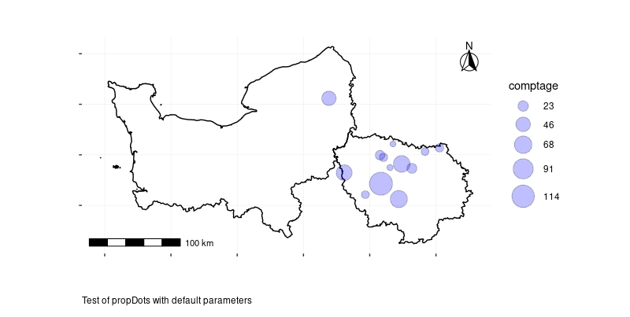
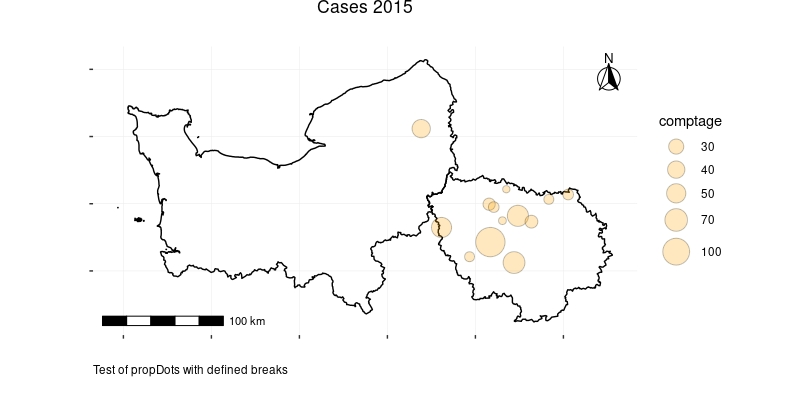
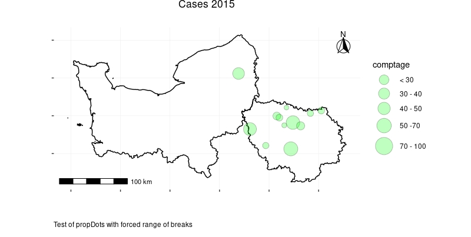
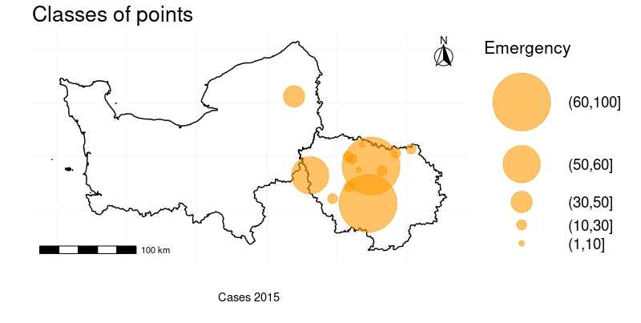
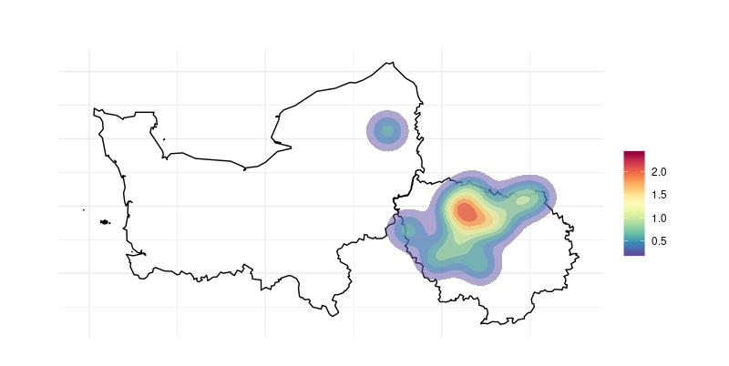
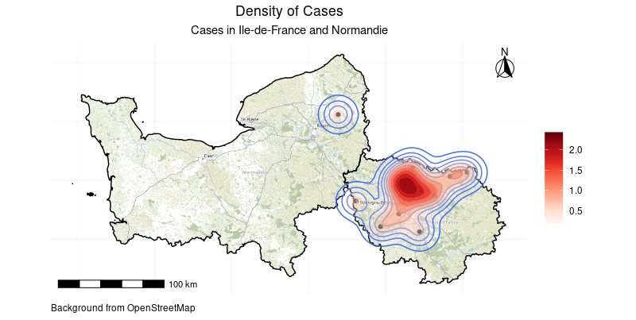
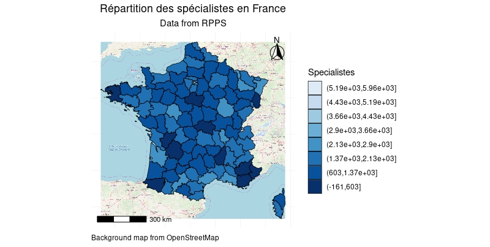
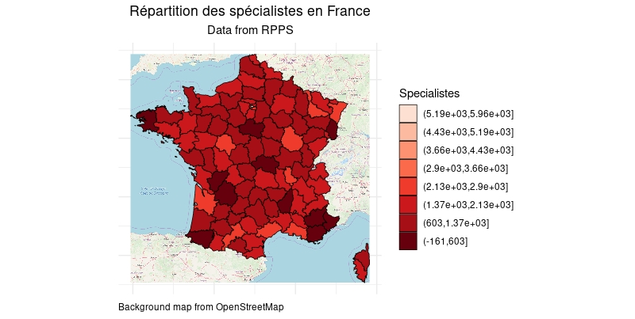

--------------------------------------------------------------------------------------------

Epiconcept is made up of a team of doctors, epidemiologists, data scientists and digital specialists.
For more than 20 years, Epiconcept has been contributing to the improvement of public health programs by providing software, epidemiological studies, counseling, evaluation and training to better prevent, detect and treat people.

Epiconcept delivers software and services in the following areas :

  - Software for managing public health programs,
  - Secure cloud solutions for health data collection, reporting and processing,
  - The implementation of research projects on measuring the effectiveness and impact of vaccines,
  - Services in the field of epidemiology (protocols, analyzes, training, etc.),
  - Expertise in data analysis,
  - Counseling, coaching and assistance to project owners for public health programs,
  - Training (short introductory modules, training through long-term practice).

To achieve such goals Epiconcept :

  - Recognized research organization,
  - Certified datacenter for hosting personal health data,
  - Training organisation.

Epiconcept relies on  :

  - Its expertise in epidemiology
  - Its IT expertise,
  - Ethical values rooted in practice (responsibility and quality of services, data security and confidentiality, scientific independence, etc.),
  - Capabilities to answer and anticipate tomorrow’s challenges (Research - evaluation, e-health, Big Data, IoT, etc.),
  - A desire to build long-term relationships with its clients and partners.

Its current customers and partners include some of the greatest names in the world such as : Santé Publique France (and many public health organizations around the world), WHO, eCDC, AFD, MSF, World Bank, etc.

--------------------------------------------------------------------------------------------


\newpage

# Graphics

## Plotting dots on a map

### dots()

*dots*( 

        x, points, color="red", value=NULL, breaks=NULL, steps=5,
      
        palette = NULL, labels = NULL, strate = NULL,
      
        title="", subtitle = "", caption  = "", legend = NULL, note=NULL
  
)

Parameter | Description                  
--------- | ---------------------------------------------------------------------------------  
**x** | **Object** GADMWrapper or GT2
**points** | **Object** data.frame with columns 'latitude' and 'longitude'
**color** | a valid color
**value** |	**Character** Name of a column in the data.frame. If is not null, colored dots are displayed according to the value.
**breaks** | **vector** of breaks
**steps** |	**Integer** Number of breaks for the value field.
**palette** | a valid palette
**labels** | **vector** of labels
**strate** | **Character** name of a column in the data.frame. If is not null, display dots with different shapes according to the value.
**title** |	**Character** title of the plot
**subtitle** |	**Character** subtitle of the plot
**caption** |	**Character** caption of the plot
**legend** | **Character** The title of the legend
**note** | **Character** Add an annotation

### Examples

For these examples we are using this data.frame

| lieu_lat| lieu_long|type   | comptage|nocif       | id_data| identifier|
|--------:|---------:|:------|--------:|:-----------|-------:|----------:|
| 49.55895|  1.384277|Type B |       45|ne sait pas |       1|          1|
| 48.86664|  2.636719|Type A |       21|Oui         |       2|          2|
| 48.60579|  1.933594|Type B |       12|Non         |       3|          3|
| 48.90998|  2.482910|Type B |       61|ne sait pas |       4|          4|
| 48.97493|  2.208252|Type C |       14|Oui         |       5|          5|
| 49.06859|  3.054199|Type B |       14|Oui         |       6|          6|
| 48.82326|  1.614990|Type A |       55|Non         |       7|          7|
| 48.87387|  2.307129|Type D |        7|ne sait pas |       9|          9|
| 48.99656|  2.156067|Type B |       19|Oui         |      10|         10|
| 49.03259|  2.834473|Type D |       12|Non         |      11|         11|
| 49.10792|  2.351074|Type C |        6|Oui         |      12|         12|
| 48.56219|  2.438965|Type B |       65|Oui         |      13|         13|
| 48.71465|  2.169800|Type A |       22|Non         |      14|         14|


-------------------------------------------------------------------------------------------------------------
**Note : ** with this data.frame, we have to rename *lieu_lat* and *lieu_long* to respectively *latitude* and *longitude*
-------------------------------------------------------------------------------------------------------------

** Simple points**

```{r eval=FALSE}
library(GADMTools)
library(sp)

map = gadm.sp.loadCountries("FRA", level=1, simplify=0.01,  basefile = "./")
map = gadm.subset(map, level=1, regions=c("Île-de-France","Haute-Normandie"))

W <- read.csv2("wepi.csv", stringsAsFactors = FALSE)
W$lieux_lat <- as.double(W$lieux_lat)
W$lieux_long <- as.double(W$lieux_long)
colnames(W)[1] <- "latitude"
colnames(W)[2] <- "longitude"

# Simple dots
#--------------------------------------------------------------------
dots(map, points = W, title="Cases 2015", note="Data from Wepi")


```


\newpage
```{r eval=FALSE}

# Classified dots
#--------------------------------------------------------------------
dots(map, points = W, 
     palette = "Reds",
     value="comptage",
     title="Classified Cases 2015", note="Data from Wepi")

```


\newpage
```{r eval=FALSE}
# Typed points
#--------------------------------------------------------------------
dots(map, points = W, 
     color = "#ee00ee",
     strate="type", 
     title="Typed Cases 2015", note="Data from Wepi")
```


\newpage
## Plotting proportionals dots

### propDots()

*propDots*( 

            x,  data, value,
            
            breaks=NULL, range=NULL,
            
            labels=NULL, color="red",
            
            title="", subtitle = "", caption = "", note=NULL
          
          )
          

Parameter | Description                  
--------- | ---------------------------------------------------------------------------------  
**x**	 | **Object** GADMWrapper or GT2
**data** | **Object** data.frame with columns 'latitude' and 'longitude'
**value** | **Character** Name of a column of the data.frame.
**breaks** | **vector** of breaks
**range**  | **vector** min, max
**labels** | **vector** of labels
**color** | a valid color
**title** | **Character** title of the plot
**subtitle** | **Character** subtitle of the plot
**caption** | **Character** caption of the plot
**note** | **Character** A note associated with the plot

\newpage
### Examples


```{r eval=FALSE}
library(GADMTools)
library(sp)

France = gadm.sf.loadCountries("FRA", level=1, basefile = "./")
Region = gadm.subset(France, regions=c("Île-de-France","Haute-Normandie"), level=1)

W <- read.csv2("wepi.csv")
W$lieux_lat <- as.double(as.character(W$lieux_lat))
W$lieux_long <- as.double(as.character(W$lieux_long))
W <- rename(W, latitude = lieux_lat, longitude = lieux_long)
W[13, "comptage"] <- 120

# Test of propDots with default parameters
# ------------------------------------------------------------------------------
propDots( Region, 
          data = W, 
          value = "comptage", 
          color="blue", 
          note="Test of propDots with default parameters")
```



**NB**: this map is rendered with Simple Features (SF) shapefiles

\newpage
```{r eval=FALSE}
# Test of propDots with defined breaks
# ------------------------------------------------------------------------------
propDots(Region, data = W, value = "comptage", color="orange",
         breaks=c(30, 40, 50, 70, 100),
         title="Cases 2015",
         caption="Test of propDots with defined breaks")
```



\newpage
```{r eval=FALSE}
propDots(Region, data = W, value = "comptage", color="green",
         range=c(1,100),
         breaks=c(30, 40, 50, 70, 100),
         title="Cases 2015",
         note="Test of propDots with forced range of breaks",
         labels = c("< 30", "30 - 40", "40 - 50", "50 -70", "70 - 100"))
```


\newpage
## Plotting dots with classified size

### classDots()

*classDots*(

            x, 
            
            data, color="red", 
            
            value = NULL, 
            
            breaks = NULL,
            
            steps = 5, 
            
            labels = NULL, 
            
            opacity = 0.5, 
            
            title="",
            
            note=NULL, 
            
            legend = NULL
            
           )


Parameter | Description                  
--------- | --------------------------------------------------------------------------------- 
**x**  | **Object** GADMWrapper or GT2
**data** |  **Object** data.frame with columns 'latitude' and 'longitude'
**color** |	a valid color
**value** |	**Character** Name of a column in the data.frame.
**breaks** | vector of breaks
**steps** |	unused
**labels** | **Character vector** of labels
**opacity** | **float** Background opacity of the filled circles
**title** | **Character** The title of the plot
**note** | **Character** Add an annotation
**legend** | **Character** The title of the legend

\newpage
### Exemple
```{r eval=FALSE}
library(GADMTools)

France = gadm.sf.loadCountries("FRA", level=1, simplify=0.01,   basefile = "./")
Region = gadm.subset(France, regions=c("Île-de-France","Normandie"), level=1)

W <- read.csv2("wepi.csv")
W$lieux_lat <- as.double(as.character(W$lieux_lat))
W$lieux_long <- as.double(as.character(W$lieux_long))
W <- rename(W, latitude = lieux_lat, longitude = lieux_long)

classDots(Region,               # Polygons
          data = W,             # Dataset
          value = "comptage",   # Varname
          color="#ff9900",
          breaks=c(1, 10, 30, 50, 60, 100),
          legend = "Emergency",
          title = "Classes of points",
          opacity = 0.6,
          note = "Cases 2015"
)

```


\newpage
## Plotting density

### isopleth()

*isopleth*(

           x, 
           
           data, 
           
           palette=NULL,
           
           title="", 
           
           subtitle = "", 
           
           caption = ""

          )


Parameter | Description                  
--------- | --------------------------------------------------------------------------------- 
**x** |	**Object** GADMWrapper or GT2
**data** | **data.frame** - data to plot
**palette** | **String** - An RColorBrewer palette name or a String vector vector of colors. Default NULL.
**title** | **String** - title of the plot
**sutitle** | **String** - subtitle of the plot
**caption** | **String** - caption of the plot

\newpage
### Example
```{r eval=FALSE}
library(GADMTools)

France = gadm.sp.loadCountries("FRA", level=1, simplify=0.01,   basefile = "./")
W <- read.csv2("wepi.csv")
W$lieux_lat <- as.double(as.character(W$lieux_lat))
W$lieux_long <- as.double(as.character(W$lieux_long))
colnames(W)[1] <- "latitude"
colnames(W)[2] <- "longitude"
Region = gadm.subset(France, regions=c("Île-de-France","Normandie"), level=1)
isopleth(Region, W)

# With Simple features (SF)
FRA_SF_1 = gadm.sf.loadCountries("FRA", level=1,   basefile = "./")
Region = gadm.subset(FRA_SF_1, regions=c("Île-de-France","Normandie"), level=1)
Region <- gadm.getBackground(Region, "FRA_IDF_NORM", type = "hotstyle")
isopleth(Region, W, palette = "Reds",
         title = "Density of Cases",
         subtitle="Cases in Ile-de-France and Normandie",
         caption="Background from OpenStreetMap")

```








-----------------------------

\newpage
## Plotting a choropleth

### choropleth()

*choropleth*(

             x, data, value=NULL, breaks = NULL, steps = 5,

             adm.join=NULL, legend = NULL, labels = NULL, palette=NULL,
             
             title="", subtitle = NULL, caption = NULL
             
             )


Parameter | Description                  
--------- | --------------------------------------------------------------------------------- 
**x** | **Object** GADMWrapper or GT2
**data** | **data.frame** - data to plot
**value** | **String** - the name of the column in the data.frame we want to plot (eg: an incidence in epidemiology studies)
**breaks** | **Vector** of breaks values or a **Sring** name of a function from *classIntervals* (one of "sd", "equal", "pretty", "quantile", "kmeans", "hclust", "bclust", "fisher", or "jenks").
**steps** | **Integer** - number of breaks. Default = 5. If breaks is NOT NULL this value is used internally with cut().
**adm.join** | **String** - the name in GADM spdf dataset which will be joined with a column of the data.
**legend** | **String** - legend title. Default NULL.
**labels** | **String** vector labels for the legend. Default NULL
**palette** | **String** - An RColorBrewer palette name or a String vector vector of colors. Default NULL.
**title** | **String** - title of the plot. Default is an empty string.
**subtitle** | **String** - subtitle of the plot. Default is NULL.
**caption** | **String** - caption of the plot. Default is NULL.

\newpage
### Example
```{r eval=FALSE}
library(GADMTools)

library(readr)
RPPS2 <- as.data.frame(read_csv2("RPPS2.csv"))
RPPS2 <- RPPS2[1:96, ]
RPPS2$ratio <- round(RPPS2$Specialistes / RPPS2$Généralistes, 3)


FRA_SF_2 <- gadm.sf.loadCountries("FRA",level = 2, basefile = "DATA/")
FRA_SF_2 <- gadm.getBackground(FRA_SF_2, name = "FRA", clip = FALSE)
choropleth(FRA_SF_2, data = RPPS2, 
           value="Specialistes",
           adm.join = "Departement",
           steps = 6,
           breaks = "sd",
           palette = rev(RColorBrewer::brewer.pal(9, "Blues")),
           title = "Répartition des spécialistes en France",
           subtitle = "Data from RPPS",
           caption = "Background map from OpenStreetMap")


FRA_SP_2 <- gadm.sp.loadCountries("FRA", level = 2, basefile = "DATA/")
FRA_SP_2 <- gadm.getBackground(FRA_SP_2, name = "FRA", clip = FALSE)
#RPPS3 <- rename(RPPS2, NAME_2 = Departement)
choropleth(FRA_SP_2, data = RPPS2, 
           steps = 6,
           value="Specialistes",
           adm.join = "NAME_2",
           breaks = "sd",
           palette = rev(RColorBrewer::brewer.pal(9, "Reds")),
           title = "Répartition des spécialistes en France",
           subtitle = "Data from RPPS",
           caption = "Background map from OpenStreetMap")


```





\newpage
### fast.choropleth()

*fast.choropleth*(

                  x, data, value=NULL,
                  
                  breaks = NULL, steps = 5,
  
                  adm.join=NULL, legend = NULL,
                  
                  labels = NULL,
                  
                  palette=NULL, title=""
                  
                 )
                 
Parameter | Description                  
--------- | --------------------------------------------------------------------------------- 
**x**	| **Object** GADMWrapper
**data**	| **data.frame** - data to plot
**value**	| **String** - the name of the column in the data.frame we want to plot (eg: an incidence in epidemiology studies)
**breaks**	| 
**steps**	| **Integer** - number of breaks. Default = 5. If breaks is NOT NULL this value is used internally with cut().
**adm.join**	| **String** - the name in GADM spdf dataset which will be joined with a column of the data.
**legend**	| **String** - legend title. Default NULL.
**labels**	| **String vector** labels for the legend. Default NULL
**palette**	| **String** - An RColorBrewer palette name or a String vector vector of colors. Default NULL.
**title**	| **String** - Title of the plot. Default is an empty string.

\newpage
### Example
```{r eval=FALSE}
MAP <- gadm.loadCountries("BEL", level = 3, simplify=0.01)
DAT = read.csv2("BE_clamydia_incidence.csv")

# Rewriting District names
# ------------------------
DAT$district <- as.character(DAT$district)
DAT[7,1] = "Brussel"
DAT[20,1] <- "Liège"
DAT[22,1] = "Marche-en-Famenne"
DAT[27,1] = "Neufchâteau"
DAT <- rename(DAT, NAME_3 = district)


fast.choropleth(MAP, DAT,
                adm.join = "NAME_3",
                value = "rate03",
                steps = 4,
                breaks = "jenks",
                palette="Greens",
                legend = "Incidence",
                title="Chlamydia incidence by Belgian district (2003)")
```


              
