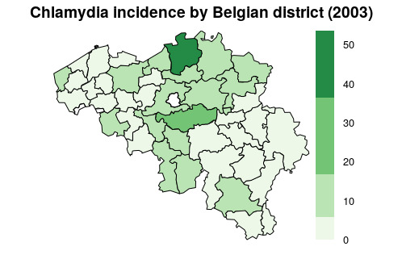

--------------------------------------------------------------------------------------------

Epiconcept is made up of a team of doctors, epidemiologists, data scientists and digital specialists.
For more than 20 years, Epiconcept has been contributing to the improvement of public health programs by providing software, epidemiological studies, counseling, evaluation and training to better prevent, detect and treat people.

Epiconcept delivers software and services in the following areas :

  - Software for managing public health programs,
  - Secure cloud solutions for health data collection, reporting and processing,
  - The implementation of research projects on measuring the effectiveness and impact of vaccines,
  - Services in the field of epidemiology (protocols, analyzes, training, etc.),
  - Expertise in data analysis,
  - Counseling, coaching and assistance to project owners for public health programs,
  - Training (short introductory modules, training through long-term practice).

To achieve such goals Epiconcept :

  - Recognized research organization,
  - Certified datacenter for hosting personal health data,
  - Training organisation.

Epiconcept relies on  :

  - Its expertise in epidemiology
  - Its IT expertise,
  - Ethical values rooted in practice (responsibility and quality of services, data security and confidentiality, scientific independence, etc.),
  - Capabilities to answer and anticipate tomorrow’s challenges (Research - evaluation, e-health, Big Data, IoT, etc.),
  - A desire to build long-term relationships with its clients and partners.

Its current customers and partners include some of the greatest names in the world such as : Santé Publique France (and many public health organizations around the world), WHO, eCDC, AFD, MSF, World Bank, etc.

--------------------------------------------------------------------------------------------


\newpage

# Graphics

## functions

Function             | Description 
:------------------- | :------------------------------------------
choropleth           | Draw a choropleth on selected regions
classDots            | Plot dots on a map with values between different fixed classestries
dots                 | Plot dots on a map
isopleth             | Draw an isopleth on selected regions
gadm_showNorth       | Display a north arrow on a plot
gadm_showScale       | Display a scale on a plot

\newpage
## Display a north arrow on a plot

```{r message=FALSE, warning=FALSE, fig.align='center', fig.height=7}
library(GADMTools)
data("Corsica")

plotmap(Corsica) %>% gadm_showNorth("tl")
```

\newpage
## Display a scale on a plot

```{r message=FALSE, warning=FALSE, fig.align='center', fig.height=7}
library(GADMTools)
data("Corsica")

plotmap(Corsica) %>% gadm_showNorth("tl") %>% gadm_showScale("bl")
```

\newpage
## Plotting dots on a map

```{r}
# Preparing data.frame
# --------------------
data("Corsica")

Corse <- gadm_union(Corsica, 0)
Cantons <- listNames(Corsica, 4)
L <- length(Cantons)
Pop <- floor(runif(L, min=15200, max=23500))

longitude <- runif(6, min=8.74, max = 9.25)
latitude  <- runif(6, min=41.7, max = 42.6)
Cases <- floor(runif(6, 25, 80))

Type <- rep(c("TYPE A", "TYPE B", "TYPE C"), 6, length.out = 6)
DAT <- data.frame(longitude, latitude, Cases)

```

\newpage
```{r fig.align='center', fig.height=7, fig.cap="Simple dots", fig.pos="h", out.extra=""}
# Simple dots
#--------------------------------------------------------------------
dots(Corsica, DAT, color="red", size = 3)

```


\newpage
```{r fig.align='center', fig.height=7, fig.cap="Classified dots", fig.pos="h", out.extra=""}

# Classified dots
#--------------------------------------------------------------------
dots(Corse, points = DAT, 
     palette = "Reds",
     value="Cases")
```


\newpage
```{r fig.align='center', fig.height=7, fig.cap="Typed dots", fig.pos="h", out.extra=""}
# Typed points
#--------------------------------------------------------------------
DAT2 <- data.frame(longitude, latitude, Type)
dots(Corse, points = DAT2, 
     color = "#ee00ee",
     strate="Type")
```


\newpage
## Plotting proportionals dots
```{r fig.align='center', fig.height=7, fig.cap="propDots", fig.pos="h", out.extra=""}
# Test of propDots with default parameters
# ------------------------------------------------------------------------------
propDots(Corse, 
         data = DAT, 
         value="Cases",
         color = "blue")
```

\newpage
```{r fig.align='center', fig.height=7, fig.cap="propDots with provided breaks", fig.pos="h", out.extra=""}
# Test of propDots with defined breaks
# ------------------------------------------------------------------------------
propDots(Corse, 
         data = DAT,
         value="Cases", breaks=c(30, 40, 50, 70, 100),
         color = "blue")

```


\newpage
```{r fig.align='center', fig.height=7, fig.cap="propDots", fig.pos="h", out.extra=""}
# Test of propDots with forced range of breaks
# ------------------------------------------------------------------------------
propDots(Corse, data = DAT, value="Cases",
         breaks=c(0, 25, 50, 75, 100), 
         range = c(25, 100))

```

\newpage
## Plotting dots with classified size

```{r fig.align='center', fig.height=7, fig.cap="classDots", fig.pos="h", out.extra=""}
library(GADMTools)

classDots(Corse, DAT, color="blue", value = "Cases", steps = 4)

```


\newpage
## Plotting density
```{r fig.align='center', fig.height=7, fig.cap="Isopleth", fig.pos="h", out.extra=""}
library(GADMTools)

isopleth(Corse, data = DAT, palette = "Blues")
```


\newpage
## Plotting a choropleth

```{r fig.align='center', fig.height=7, fig.cap="Choropleth", fig.pos="h", out.extra=""}
DAT <- data.frame(Cantons, Pop)
choropleth(Corsica, data = DAT, value = "Pop", adm.join = "Cantons",
           breaks = "sd", palette = "Greens")
```


\newpage
### fast.choropleth()

*fast.choropleth*(

                  x, data, value=NULL,
                  
                  breaks = NULL, steps = 5,
  
                  adm.join=NULL, legend = NULL,
                  
                  labels = NULL,
                  
                  palette=NULL, title=""
                  
                 )
                 
Parameter | Description                  
--------- | --------------------------------------------------------------------------------- 
**x**	| **Object** GADMWrapper
**data**	| **data.frame** - data to plot
**value**	| **String** - the name of the column in the data.frame we want to plot (eg: an incidence in epidemiology studies)
**breaks**	| 
**steps**	| **Integer** - number of breaks. Default = 5. If breaks is NOT NULL this value is used internally with cut().
**adm.join**	| **String** - the name in GADM spdf dataset which will be joined with a column of the data.
**legend**	| **String** - legend title. Default NULL.
**labels**	| **String vector** labels for the legend. Default NULL
**palette**	| **String** - An RColorBrewer palette name or a String vector vector of colors. Default NULL.
**title**	| **String** - Title of the plot. Default is an empty string.

\newpage
### Example
```{r eval=FALSE,  fig.pos="h", out.extra=""}
MAP <- gadm_sp_loadCountries("BEL", level = 3, simplify=0.01)
DAT = read.csv2("BE_clamydia_incidence.csv")

# Rewriting District names
# ------------------------
DAT$district <- as.character(DAT$district)
DAT[7,1] = "Brussel"
DAT[20,1] <- "Liège"
DAT[22,1] = "Marche-en-Famenne"
DAT[27,1] = "Neufchâteau"
DAT <- rename(DAT, NAME_3 = district)


fast.choropleth(MAP, DAT,
                adm.join = "NAME_3",
                value = "rate03",
                steps = 4,
                breaks = "jenks",
                palette="Greens",
                legend = "Incidence",
                title="Chlamydia incidence by Belgian district (2003)")
```


              
