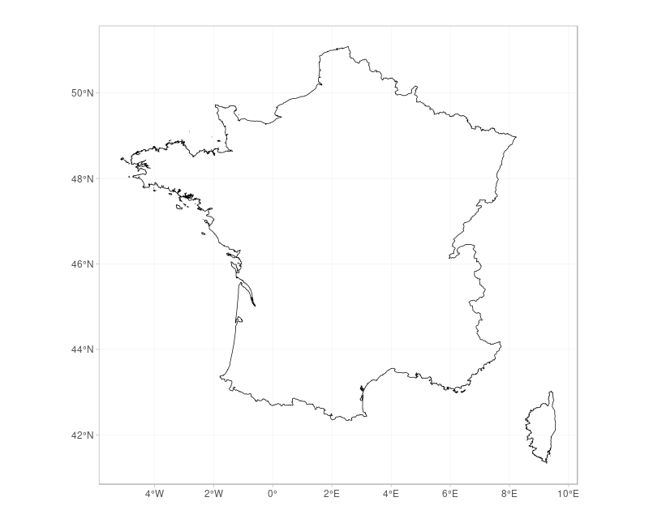
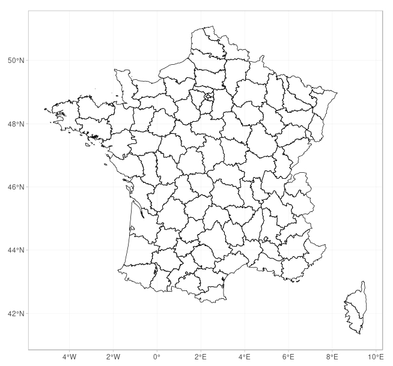
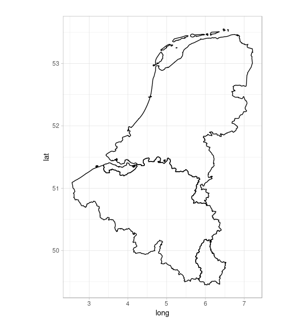
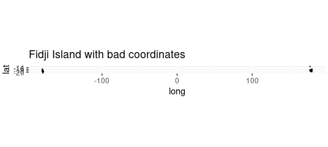
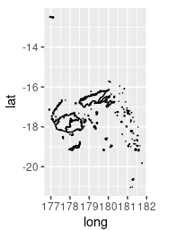
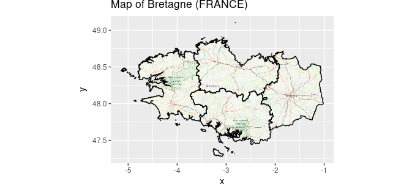

--------------------------------------------------------------------------------------------

Epiconcept is made up of a team of doctors, epidemiologists, data scientists and digital specialists.
For more than 20 years, Epiconcept has been contributing to the improvement of public health programs by providing software, epidemiological studies, counseling, evaluation and training to better prevent, detect and treat people.

Epiconcept delivers software and services in the following areas :

  - Software for managing public health programs,
  - Secure cloud solutions for health data collection, reporting and processing,
  - The implementation of research projects on measuring the effectiveness and impact of vaccines,
  - Services in the field of epidemiology (protocols, analyzes, training, etc.),
  - Expertise in data analysis,
  - Counseling, coaching and assistance to project owners for public health programs,
  - Training (short introductory modules, training through long-term practice).

To achieve such goals Epiconcept :

  - Recognized research organization,
  - Certified datacenter for hosting personal health data,
  - Training organisation.

Epiconcept relies on  :

  - Its expertise in epidemiology
  - Its IT expertise,
  - Ethical values rooted in practice (responsibility and quality of services, data security and confidentiality, scientific independence, etc.),
  - Capabilities to answer and anticipate tomorrow’s challenges (Research - evaluation, e-health, Big Data, IoT, etc.),
  - A desire to build long-term relationships with its clients and partners.

Its current customers and partners include some of the greatest names in the world such as : Santé Publique France (and many public health organizations around the world), WHO, eCDC, AFD, MSF, World Bank, etc.

--------------------------------------------------------------------------------------------


\newpage
# What is GADM?

GADM, the Database of Global Administrative Areas, is a high-resolution database of country administrative areas, with a goal of "all countries, at all levels, at any time period.
The database has a few export formats, including shapefiles that are used in most common GIS applications.[2] Files formatted for the programming language R are also available, allowing the easy creation of descriptive data plots that include geographical maps.
Although it is a public database, GADM has a higher spatial resolution than other free databases and also higher than commercial software such as ArcGIS.
GADM is not freely available for commercial use. The GADM project created the spatial data for many countries from spatial databases provided by national governments, NGO, and/or from maps and lists of names available on the Internet (e.g. from Wikipedia).

The GADM website and data repository is hosted at UC Davis in the Hijmans Lab. The Hijman lab is run by Robert Hijmans an Environmental Science and Policy faculty member in the Geography Graduate Group. [ source Wikipedia - <https://en.wikipedia.org/wiki/GADM> ]

# What is GADMTools?

**GADMTools** is an R package to manipulate shapefiles from GADM and to make geo-statistical representations easily.

**GADMTools** can use 2 shapefile formats, *SpatialPolyonsDataFrame (SP)* and *Simple Features (SF)*, both provided by GADM as .rds files.

**NB**: the SF format is supported only from version 3.5 of GADMTools.


****************

\newpage
# Manipulating shapefiles

## functions

SpatialPolygons | Simple Features | Description 
:------------------- | :------------------- | :--------------------------------
gadm_sp_loadCountries | gadm_sf_loadCountries | downloads or loads one or more shapefiles
gadm_getBackground | gadm_getBackground | Gets tiles with 'rosm' from OpenStreetMap
gadm_loadStripped |  | Load a GADM stripped shapefile
gadm_remove | gadm_remove | Removes one or more regions from a map in a GADMWrapper/GT2 object
gadm_removeBackground | gadm_removeBackground | Removes the background of a map
gadm_saveStripped | | Save a stripped GADM object
gadm_subset | gadm_subset | Extract regions. "subset" does not work since release 3.5-1
gadm_union | gadm_union | Merges regions
listNames | listNames | List the region names for an administrative level
saveAs | saveAs | Save your own GADM shapefile as a .rds file
stripSP |  | Strip a GADMWrapper object

## Added in version 3.6

SpatialPolygons | Simple Features | Description 
:------------------- | :------------------- | :--------------------------------
gadm_getBbox         | gadm_getBbox         | get the bounding box of the map
gadm_crop            | gadm_crop            | crop a region to a specific rectangle
gadm_longTo360       | gadm_longTo360       | Converts longitudes from -180° - 0° - 180° to 0° - 360°
gadm_removeBackground| gadm_removeBackground| Removes the background of a map


**CAUTION**: Functions whose names were previously prefixed by "gadm." are now prefixed by "gadm_" for compliance with the R language coding conventions. Older functions are still availables for this release but will be removed in the next release. Generally all the "." in the function names have been replaced by "_".

Function *gadm.loadCountries* has been removed.


\newpage
## Format SP : gadm_sp_loadCountries() / gadm_load.countries
\par\noindent\rule[20pt]{\textwidth}{0.4pt}
This is a main function of GADMTools, with it, you can load or download one or more shapefiles. If you load many shapefiles, the function assembles the shapefiles into one. 


The old function *gadm_loadCountries* has been removed.


*gadm_sp_loadCountries*(

                   fileNames,
                   
                   level = 0, 
                   
                   basefile=GADM_BASE,
                   
                   baseurl=GADM_URL,
                   
                   simplify=NULL
                   
                  )
                  

Parameter | Description                  
--------- | ---------------------------------------------------------------------------------                 
**fileNames**    | **Character vector** of named regions. An ISO-3166-1 code or a custom name. You don't have to specify the suffix (admX) nor the file extension (.rds).
**level** | **Integer** - the level of the administrative boundaries (0 is the country, higher values equal finer divisions)
**basefile** | **Character** - the path of the directory where shapefiles are stored. Default is "./GADM"
**baseurl** | **Character** - the url of GADM files. Default is <http://biogeo.ucdavis.edu/data/gadm_.8/rds/>
**simplify** | **Numeric** numerical tolerance value to be used by the Douglas-Peuker algorithm. Higher values use less polygon points (and less memory) and lower values use more polygon points (and more memory). We suggest not going higher than 0.025 in order for intra-country boundaries to align.


**Return**: Object *gadm_sp*


\newpage
## Format SF : gadm_sf_loadCountries()
\par\noindent\rule[20pt]{\textwidth}{0.4pt}
This is a main function of GADMTools, with it, you can load or download one or more shapefiles. If you load many shapefiles, the function assembles the shapefiles into one. 


*gadm_sf_loadCountries*(

                   fileNames,
                   
                   level = 0, 
                   
                   basefile=GADM_BASE,
                   
                   baseurl=GADM_URL,
                   
                   simplify=NULL
                   
                  )


Parameter | Description                  
--------- | ---------------------------------------------------------------------------------                 
**fileNames**    | **Character vector** of named regions. An ISO-3166-1 code or a custom name. You don't have to specify the suffix (admX) nor the file extension (.rds).
**level** | **Integer** - the level of the administrative boundaries (0 is the country, higher values equal finer divisions)
**basefile** | **Character** - the path of the directory where shapefiles are stored. Default is "./GADM"
**baseurl** | **Character** - the url of GADM files. Default is <http://biogeo.ucdavis.edu/data/gadm_.8/rds/>
**simplify** | **Numeric** numerical tolerance value to be used by the Douglas-Peuker algorithm. Higher values use less polygon points (and less memory) and lower values use more polygon points (and more memory). We suggest not going higher than 0.025 in order for intra-country boundaries to align.


**Return**: Object *gadm_sf*


\newpage

## Loading a country
\par\noindent\rule[20pt]{\textwidth}{0.4pt}
```{r echo=FALSE, message=FALSE}
library(GADMTools)
data("Corsica")

```


```{r eval=FALSE}
library(GADMTools)

# Loading country border (level=0 [default])
# -----------------------------------------------------------------
map <- gadm_sf_loadCountries("FRA", basefile = "./")
gadm_plot(map) + theme_light()
```
   
      
      
```{r out.width="500px", echo=FALSE, fig.align='center', fig.cap="Loading a single country (level = 0)", fig.pos="h", out.extra=""}

```


\newpage
## Loading a country at an administrative level
\par\noindent\rule[20pt]{\textwidth}{0.4pt}
```{r eval=FALSE}
library(GADMTools)
data("Corsica")


# Loading regions @ level = 2])
# -----------------------------------------------------------------
map <- gadm_sp_loadCountries(c("FRA"), level=2, basefile = "./")
gadm_plot(map)
```

      
```{r out.width="500px", echo=FALSE, fig.cap="loading regions of a country @ level = 2", fig.pos="h", out.extra=""}

```


**NB**: you can use *gadm_sf_loadCountries* instead of *gadm_sp_loadCountries*


\newpage
## Assembling many countries

```{r eval=FALSE}
library(GADMTools)

# Assemble administrative boundaries (country level = 0)
# -----------------------------------------------------------------
map <- gadm_sp_loadCountries(c("BEL","LUX","NLD"),  basefile = "./")
gadm_plot(map + theme_light()
```

```{r out.width="500px", echo=FALSE, fig.cap="Benelux = Belgium + Luxembourg + Netherlands @ level = 0", fig.pos="h", out.extra=""}

```


**NB**: you can use *gadm_sf_loadCountries* instead of *gadm_sp_loadCountries*


\newpage
## Extracting regions
\par\noindent\rule[20pt]{\textwidth}{0.4pt}
### First extracting "Corse" from France @ level 4
```{r eval = FALSE}
FRA <- gadm_sf_loadCountries("FRA", level = 4, basefile = "./")
Corsica <- gadm_subset(FRA, level=1, regions="Corse")
```

```{r fig.height=7, fig.align='center', fig.cap="Corsica (Region of France) @ level 4", fig.pos="h", out.extra=""}
gadm_plot(Corsica) %>% gadm_showNorth("tl") %>% gadm_showScale('bl')
```

\newpage
In order to extract some regions of a map we need to know them. The *listNames()* function allows this. The subset function is then used to extract the desired regions.

CAUTION: only the administrative levels that have been loaded in the loadCountries object can be listed. For instance, with a map loaded @ level 4, the level for listNames can be one of [0, 1, 2, 3, 4]. Names are given in the country's language or English.

```{r}
listNames(Corsica, 2)

```


```{r fig.height=7, fig.align='center', fig.cap="Corsica - Haute-Corse", fig.pos="ht", out.extra=""}

HCorse <- gadm_subset(Corsica, regions="Haute-Corse", level=2)
gadm_plot(HCorse)
```

\newpage
## Merging regions
\par\noindent\rule{\textwidth}{0.4pt}

```{r fig.align='center', fig.height=7.1, fig.cap='Corsica with districts only', fig.pos="h", out.extra=""}
UCorse <- gadm_union(Corsica, level=3, type="Arrondissements")
gadm_plot(UCorse)

```

\newpage
## Removing regions
\par\noindent\rule[20pt]{\textwidth}{0.4pt}
```{r}
listNames(Corsica, 3)
```


```{r fig.height=6.8, fig.align='center', fig.cap="Corsica without district of Corte", fig.pos="h", out.extra=""}
Corse_without_Corte <- gadm_remove(Corsica, regions="Corte", 3)
gadm_plot(Corse_without_Corte)
```


\newpage
## Cropping an area
\par\noindent\rule[20pt]{\textwidth}{0.4pt}
First get the bounding box of Corsica
```{r "getBbox"}
gadm_getBbox(Corsica)
```

And now, cropping at ours custom coordinates

```{r fig.width=7.5, fig.align='center', warning=FALSE, fig.pos="h", out.extra=""}
STUDY_AREA <- gadm_crop(Corsica, xmin=9.3, ymin=42.96, xmax=9.566, ymax=43.02819)
gadm_plot(STUDY_AREA)
```

\newpage
### Converting longitudes to 0 - 360
\par\noindent\rule[20pt]{\textwidth}{0.4pt}
```{r eval=FALSE, fig.pos="h", out.extra="" }
library(GADMTools)
FJI = gadm_sp_loadCountries("FJI", 1, basefile = "./")
gadm_plot(FJI, title = "Fidji Island with bad coordinates")
```

```{r out.width="4500px", echo=FALSE, fig.align='center', fig.cap="Fiji Islands, with polygons crossing the Date Line", fig.pos="h", out.extra=""}

```


```{r eval=FALSE}
FJI = gadm_longTo360(FJI)
gadm_plot(FJI, title = "Fidji Island with 0 - 360 coordinates")
```


```{r out.width="300px", echo=FALSE, fig.align='center', fig.cap="Fiji Islands, with polygons crossing the Date Line", fig.pos="h", out.extra=""}

```

\newpage
## Adding a background image from OpenstreetMap
\par\noindent\rule[20pt]{\textwidth}{0.4pt}

```{r eval=FALSE}
library(GADMTools)
library(rosm)
FRA = gadm_sp_loadCountries("FRA", 2, basefile = "./")
BRE = gadm_subset(FRA, level=1, regions=c("Bretagne"))
BRE2 <- gadm_getBackground(BRE, "BRE", "osm")
gadm_plot(BRE2, title = "Map of Bretagne (FRANCE)")
```

```{r out.width="500px", echo=FALSE, fig.align='center', fig.cap="map of Bretagne with background from OSM @ level = 2", fig.pos="h", out.extra=""}

```


\newpage
## Remove a background previously loaded with gadm_getBackground
\par\noindent\rule[20pt]{\textwidth}{0.4pt}

*gadm_removeBackground*( x )


