--------------------------------------------------------------------------------------------

Epiconcept is made up of a team of doctors, epidemiologists, data scientists and digital specialists.
For more than 20 years, Epiconcept has been contributing to the improvement of public health programs by providing software, epidemiological studies, counseling, evaluation and training to better prevent, detect and treat people.

Epiconcept delivers software and services in the following areas :

  - Software for managing public health programs,
  - Secure cloud solutions for health data collection, reporting and processing,
  - The implementation of research projects on measuring the effectiveness and impact of vaccines,
  - Services in the field of epidemiology (protocols, analyzes, training, etc.),
  - Expertise in data analysis,
  - Counseling, coaching and assistance to project owners for public health programs,
  - Training (short introductory modules, training through long-term practice).

To achieve such goals Epiconcept :

  - Recognized research organization,
  - Certified datacenter for hosting personal health data,
  - Training organisation.

Epiconcept relies on  :

  - Its expertise in epidemiology
  - Its IT expertise,
  - Ethical values rooted in practice (responsibility and quality of services, data security and confidentiality, scientific independence, etc.),
  - Capabilities to answer and anticipate tomorrow’s challenges (Research - evaluation, e-health, Big Data, IoT, etc.),
  - A desire to build long-term relationships with its clients and partners.

Its current customers and partners include some of the greatest names in the world such as : Santé Publique France (and many public health organizations around the world), WHO, eCDC, AFD, MSF, World Bank, etc.

--------------------------------------------------------------------------------------------


\newpage
# What is GADM?

GADM, the Database of Global Administrative Areas, is a high-resolution database of country administrative areas, with a goal of "all countries, at all levels, at any time period.
The database has a few export formats, including shapefiles that are used in most common GIS applications.[2] Files formatted for the programming language R are also available, allowing the easy creation of descriptive data plots that include geographical maps.
Although it is a public database, GADM has a higher spatial resolution than other free databases and also higher than commercial software such as ArcGIS.
GADM is not freely available for commercial use. The GADM project created the spatial data for many countries from spatial databases provided by national governments, NGO, and/or from maps and lists of names available on the Internet (e.g. from Wikipedia).

The GADM website and data repository is hosted at UC Davis in the Hijmans Lab. The Hijman lab is run by Robert Hijmans an Environmental Science and Policy faculty member in the Geography Graduate Group. [ source Wikipedia - <https://en.wikipedia.org/wiki/GADM> ]

# What is GADMTools?

GADMTools is an R package to manipulate shapefiles from GADM and to make geo-statistical representations easily.

****************

\newpage
# Manipulating shapefiles

## gadm.loadCountries()

This is the main function of GADMTools, with it, you can load or download one or more shapefiles. If you load many shapefiles, the function assembles the shapefiles into one.


gadm.loadCountries(

                   fileNames,
                   
                   level = 0, 
                   
                   basefile=GADM_BASE,
                   
                   baseurl=GADM_URL,
                   
                   simplify=NULL
                   
                  )
                  

Parameter | Description                  
--------- | ---------------------------------------------------------------------------------                 
**fileNames**    | **Character vector** of named regions. An ISO-3166-1 code or a custom name. You don't have to specify the suffix (admX) nor the file extension (.rds).
**level** | **Integer** - the level of the administrative boundaries (0 is the country, higher values equal finer divisions)
**basefile** | **Character** - the path of the directory where shapefiles are stored. Default is "./GADM"
**baseurl** | **Character** - the url of GADM files. Default is <http://biogeo.ucdavis.edu/data/gadm2.8/rds/>
**simplify** | **Numeric** numerical tolerance value to be used by the Douglas-Peuker algorithm. Higher values use less polygon points (and less memory) and lower values use more polygon points (and more memory). We suggest not going higher than 0.01 in order for intra-country boundaries to align.


\newpage

-------------------------------------------------------------------------------
ISO3 CODES
-------------------------------------------------------------------------------


 |  |  |  |  |   |  |   |  | 
:---: | --- | --- | --- | --- | ---  | ---  | ---  | --- | ---
ABW | AFG | AGO | AIA | ALA | ALB | AND | ANT | ARE | ARG
ARM | ASM | ATA | ATF | ATG | AUS | AUT | AZE | BDI | BEL
BEN | BFA | BGD | BGR | BHR | BHS | BIH | BLM | BLR | BLZ
BMU | BOL | BRA | BRB | BRN | BTN | BVT | BWA | CAF | CAN
CCK | CHE | CHL | CHN | CIV | CMR | COD | COG | COK | COL
COM | CPV | CRI | CUB | CXR | CYM | CYP | CZE | DEU | DJI
DMA | DNK | DOM | DZA | ECU | EGY | ERI | ESH | ESP | EST
ETH | FIN | FJI | FLK | FRA | FRO | FSM | GAB | GBR | GEO
GGY | GHA | GIB | GIN | GLP | GMB | GNB | GNQ | GRC | GRD
GRL | GTM | GUF | GUM | GUY | HKG | HMD | HND | HRV | HTI
HUN | IDN | IMN | IND | IOT | IRL | IRN | IRQ | ISL | ISR
ITA | JAM | JEY | JOR | JPN | KAZ | KEN | KGZ | KHM | KIR
KNA | KOR | KWT | LAO | LBN | LBR | LBY | LCA | LIE | LKA
LSO | LTU | LUX | LVA | MAC | MAF | MAR | MCO | MDA | MDG
MDV | MEX | MHL | MKD | MLI | MLT | MMR | MNE | MNG | MNP
MOZ | MRT | MSR | MTQ | MUS | MWI | MYS | MYT | NAM | NCL
NER | NFK | NGA | NIC | NIU | NLD | NOR | NPL | NRU | NZL
OMN | PAK | PAN | PCN | PER | PHL | PLW | PNG | POL | PRI
PRK | PRT | PRY | PSE | PYF | QAT | REU | ROU | RUS | RWA
SAU | SDN | SEN | SGP | SGS | SHN | SJM | SLB | SLE | SLV
SMR | SOM | SPM | SRB | STP | SUR | SVK | SVN | SWE | SWZ
SYC | SYR | TCA | TCD | TGO | THA | TJK | TKL | TKM | TLS
TON | TTO | TUN | TUR | TUV | TWN | TZA | UGA | UKR | UMI
URY | USA | UZB | VAT | VCT | VEN | VGB | VIR | VNM | VUT
WLF | WSM | YEM | ZAF | ZMB | ZWE


\newpage
### Loading a shapefile

```{r eval=FALSE}
library(GADMTools)
library(sp)

# Loading country border (level=0 [default])
# -----------------------------------------------------------------
map <- gadm.loadCountries("FRA", basefile = "./")
plotmap(map)
```

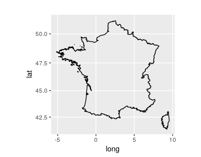

\newpage
### Loading an administrative level

```{r eval=FALSE}
library(GADMTools)
library(sp)

# Loading regions @ level = 2])
# -----------------------------------------------------------------
map <- gadm.loadCountries(c("FRA"), level=2, basefile = "./")
plotmap(map)
```

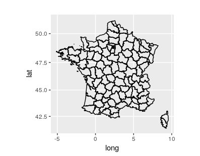


\newpage
### Assembling many shapefiles


```{r eval=FALSE}
library(GADMTools)
library(sp)

# Assemble administrative boundaries (country level = 0)
# -----------------------------------------------------------------
map <- gadm.loadCountries(c("BEL","LUX","NLD"))
plotmap(map, title="Bénélux")
```

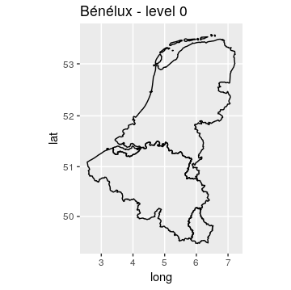


\newpage
## Extracting regions

In order to extract some regions of a map we need to know them. The listNames function allows this. The subset function is then used to extract the desired regions.


### listNames()

*listNames*(

          x,
          
          level = 0
          
         )

Parameter | Description                  
--------- | ---------------------------------------------------------------------------------                 
**x** | **Object** - a GADMWrapper object (a map)
**level** | **Integer** - the value of the administration level to list. Attention: only the administrative levels that have been loaded in the loadCountries object can be listed. Names are given in the country's language or English.

### subset()

*subset*(

       x,

       level = NULL,

       regions = NULL

      )


Parameter | Description                  
--------- | ---------------------------------------------------------------------------------                 
**x** | **Object** GADMWrapper
**level** | **Integer** the level at which the regions are extracted from
**regions** | **String vector** of named regions

\newpage
### Example

```{r eval=FALSE}
# Extract some regions of a map
# -----------------------------------------------------------------
library(GADMTools)
library(sp)

FR = gadm.loadCountries("FRA", level=2)
listNames(FR, level=2)
AV = subset(FR, regions=c("Allier", "Cantal",
            "Haute-Loire","Puy-de-Dôme"))
plotmap(AV)
```
 | | | | 
--------- | ---------- | ------------- | --------------- | -------------
[1] "Bas-Rhin" |               "Haut-Rhin" |               "Dordogne" |                "Gironde" |                
 [5] "Landes" |                  "Lot-et-Garonne" |          "Pyrénées-Atlantiques" |    "Allier"                 
 [9] "Cantal" |                  "Haute-Loire" |             "Puy-de-Dôme" |             "Essonne" |              
[13] "Hauts-de-Seine" |          "Paris" |                   "Seine-et-Marne" |          "Seine-Saint-Denis"      
[17] "Val-d'Oise" |              "Val-de-Marne" |            "Yvelines" |                "Calvados" |           
[21] "Manche" |                 "Orne" |                "Côte-d'Or" |             "Nièvre"                 
[25] "Saône-et-Loire" |        "Yonne" |               "Côtes-d'Armor" |           "Finistère"              
[29] "Ille-et-Vilaine" |     "Morbihan" |              "Cher" |                  "Eure-et-Loir" |         
[33] "Indre-et-Loire" |        "Indre" |               "Loir-et-Cher" |          "Loiret"                 
[37] "Ardennes" |              "Aube" |                  "Haute-Marne" |         "Marne"                  
[41] "Corse-du-Sud" |          "Haute-Corse" |         "Doubs" |               "Haute-Saône"            
[45] "Jura" |                  "Territoire de Belfort" | "Eure" |                  "Seine-Maritime"         
[49] "Aude" |                  "Gard" |                  "Hérault" |             "Lozère"                 
[53] "Pyrénées-Orientales" | "Corrèze" |             "Creuse" |                "Haute-Vienne"           
[57] "Meurthe-et-Moselle" |    "Meuse" |               "Moselle" |             "Vosges"                 
[61] "Ariège" |                "Aveyron" |             "Gers" |                  "Haute-Garonne"          
[65] "Hautes-Pyrénées" |     "Lot" |                 "Tarn-et-Garonne" |     "Tarn"                   
[69] "Nord" |                  "Pas-de-Calais" |       "Loire-Atlantique" |      "Maine-et-Loire"         
[73] "Mayenne" |             "Sarthe" |                "Vendée" |                "Aisne"                  
[77] "Oise" |                  "Somme" |               "Charente-Maritime" |   "Charente"               
[81] "Deux-Sèvres" |         "Vienne" |                "Alpes-de-Haute-Provence" | "Alpes-Maritimes"        
[85] "Bouches-du-Rhône" |      "Hautes-Alpes" |          "Var" |                 "Vaucluse"               
[89] "Ain" |                 "Ardèche" |             "Drôme" |               "Haute-Savoie"           
[93] "Isère" |               "Loire" |               "Rhône" |               "Savoie"                 

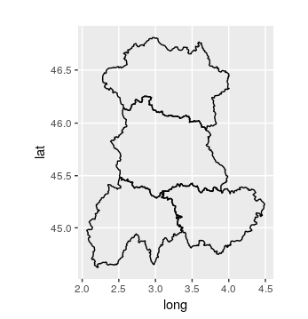

---------------------------


\newpage
## Removing regions

### remove()

*remove*( 

       x, 
      
       level=NULL, 
      
       regions=NULL
      
      )

Parameter | Description                  
--------- | ---------------------------------------------------------------------------------  
**x** | **Object** GADMWrapper
**level** | **Integer** - level from which shapes are removed. If NULL, curent level is used.
**regions** | **String vector** of regions to be removed

### Example

```{r eval=FALSE}
library(GADMTools)
library(sp)

FR = gadm.loadCountries("FRA", level=1)
plotmap(FR)
listNames(FR, level=1)
FR2 = remove(FR, level = 1, regions = c("Alsace", "Lorraine"))
plotmap(FR2)
```

\newpage
 | |  
--------- | ---------- | -------------
[1] "Alsace" |                   "Aquitaine" |                 "Auvergne"                  
 [4] "Île-de-France" |              "Basse-Normandie" |            "Bourgogne"                 
 [7] "Bretagne" |                   "Centre" |                     "Champagne-Ardenne"        
[10] "Corse" |                      "Franche-Comté" |              "Haute-Normandie"         
[13] "Languedoc-Roussillon" |       "Limousin" |                   "Lorraine"                  
[16] "Midi-Pyrénées" |              "Nord-Pas-de-Calais" |         "Pays de la Loire"         
[19] "Picardie" |                   "Poitou-Charentes" |           "Provence-Alpes-Côte d'Azur"
[22] "Rhône-Alpes"  |  |              

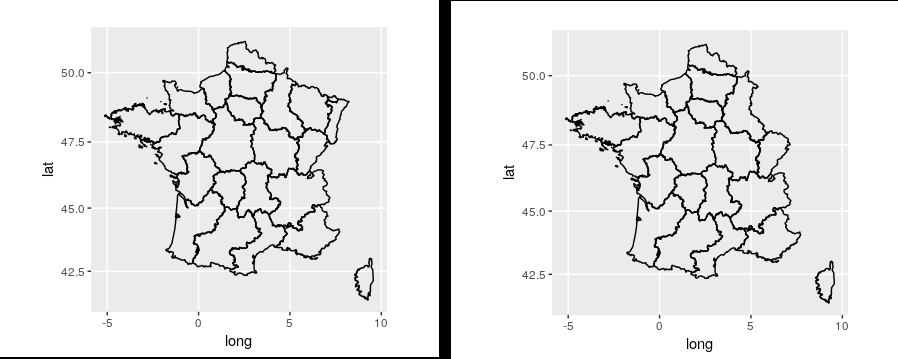


\newpage
# Graphics

## Plotting dots on a map

### dots()

*dots*(

       x, points, color="red", value = NULL,
    
       breaks = NULL, steps = 5, palette = NULL, labels = NULL, strate = NULL,

       title="", legend = NULL, note=NULL
    
    )

Parameter | Description                  
--------- | ---------------------------------------------------------------------------------  
**x** | **Object** GADMWrapper
**points** | **Object** data.frame with columns 'latitude' and 'longitude'
**color** | a valid color
**value** |	**Character** Name of a column in the data.frame. If is not null, colored dots are displayed according to the value.
**breaks** | **vector** of breaks
**steps** |	**Integer** Number of breaks for the value field.
**palette** | a valid palette
**labels** | **vector** of labels
**strate** | **Character** name of a column in the data.frame. If is not null, display dots with different shapes according to the value.
**title** |	**Character** The title of the plot
**legend** | **Character** The title of the legend
**note** | **Character** Add an annotation

### Examples

For these examples we are using this data.frame

| lieu_lat| lieu_long|type   | comptage|nocif       | id_data| identifier|
|--------:|---------:|:------|--------:|:-----------|-------:|----------:|
| 49.55895|  1.384277|Type B |       45|ne sait pas |       1|          1|
| 48.86664|  2.636719|Type A |       21|Oui         |       2|          2|
| 48.60579|  1.933594|Type B |       12|Non         |       3|          3|
| 48.90998|  2.482910|Type B |       61|ne sait pas |       4|          4|
| 48.97493|  2.208252|Type C |       14|Oui         |       5|          5|
| 49.06859|  3.054199|Type B |       14|Oui         |       6|          6|
| 48.82326|  1.614990|Type A |       55|Non         |       7|          7|
| 48.87387|  2.307129|Type D |        7|ne sait pas |       9|          9|
| 48.99656|  2.156067|Type B |       19|Oui         |      10|         10|
| 49.03259|  2.834473|Type D |       12|Non         |      11|         11|
| 49.10792|  2.351074|Type C |        6|Oui         |      12|         12|
| 48.56219|  2.438965|Type B |       65|Oui         |      13|         13|
| 48.71465|  2.169800|Type A |       22|Non         |      14|         14|


-------------------------------------------------------------------------------------------------------------
**Note : ** with this data.frame, we have to rename *lieu_lat* and *lieu_long* to respectively *latitude* and *longitude*
-------------------------------------------------------------------------------------------------------------


```{r eval=FALSE}
library(GADMTools)
library(sp)

map = gadm.loadCountries("FRA", level=1, simplify=0.01)
map = subset(map, level=1, regions=c("Île-de-France","Haute-Normandie"))

W <- read.csv2("wepi.csv", stringsAsFactors = FALSE)
W$lieux_lat <- as.double(W$lieux_lat)
W$lieux_long <- as.double(W$lieux_long)
colnames(W)[1] <- "latitude"
colnames(W)[2] <- "longitude"

# Simple dots
#--------------------------------------------------------------------
dots(map, points = W, title="Cases 2015", note="Data from Wepi")


```

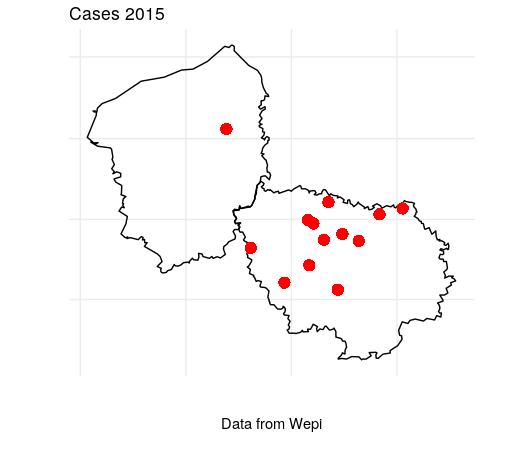

\newpage
```{r eval=FALSE}

# Classified dots
#--------------------------------------------------------------------
dots(map, points = W, 
     palette = "Reds",
     value="comptage",
     title="Classified Cases 2015", note="Data from Wepi")

```
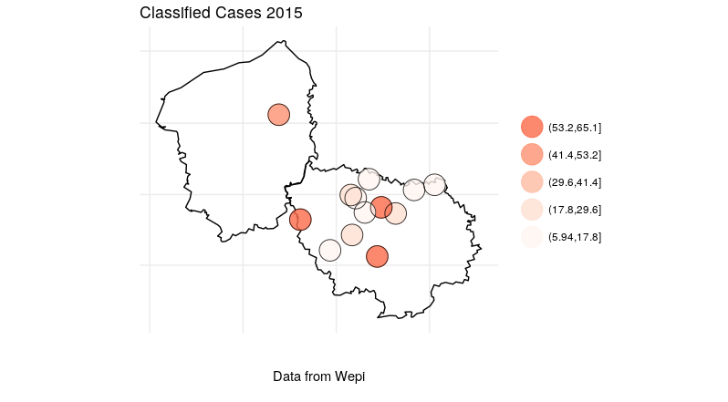


\newpage
```{r eval=FALSE}
# Typed points
#--------------------------------------------------------------------
dots(map, points = W, 
     color = "#ee00ee",
     strate="type", 
     title="Typed Cases 2015", note="Data from Wepi")
```
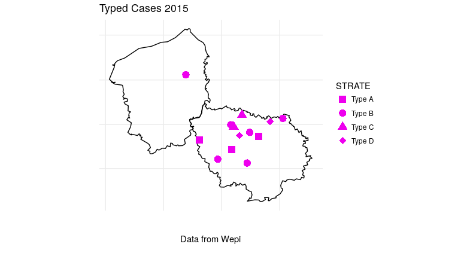


\newpage
## Plotting proportionals dots

### propDots()

*propDots*( 

            x, 
            
            data,
            
            value,
            
            breaks=NULL,
            
            range=NULL,
            
            labels=NULL,
            
            color="red",
            
            title="",
            
            note=NULL
          
          )
          

Parameter | Description                  
--------- | ---------------------------------------------------------------------------------  
**x**	 | **Object** GADMWrapper
**data** | **Object** data.frame with columns 'latitude' and 'longitude'
**value** | **Character** Name of a column of the data.frame.
**breaks** | **vector** of breaks
**range**  | **vector** min, max
**labels** | **vector** of labels
**color** | a valid color
**title** | **Character** The title of the plot
**note** | **Character** A note associated with the plot

\newpage
### Examples


```{r eval=FALSE}
library(GADMTools)
library(sp)

France = gadm.loadCountries("FRA", level=1, simplify=0.01)
Region = subset(France, regions=c("Île-de-France","Haute-Normandie"), level=1)

W <- read.csv2("wepi.csv")
W$lieux_lat <- as.double(as.character(W$lieux_lat))
W$lieux_long <- as.double(as.character(W$lieux_long))
W <- rename(W, latitude = lieux_lat, longitude = lieux_long)


# Test of propDots with default parameters
# ------------------------------------------------------------------------------
propDots( Region, 
          data = W, 
          value = "comptage", 
          color="blue", 
          note="Test of propDots with default parameters")
```
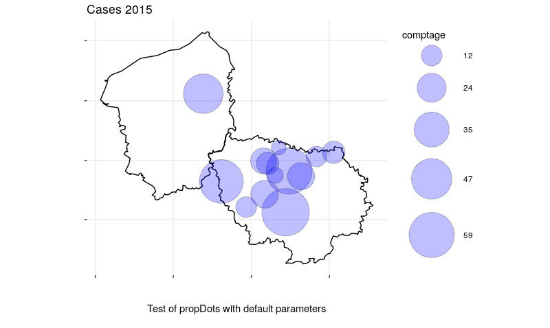

\newpage
```{r eval=FALSE}
# Test of propDots with default parameters
# ------------------------------------------------------------------------------
propDots(Region, data = W, value = "comptage", color="orange",
         breaks=c(30, 40, 50, 70, 100),
         title="Cases 2015",
         note="Test of propDots with defined breaks")
```

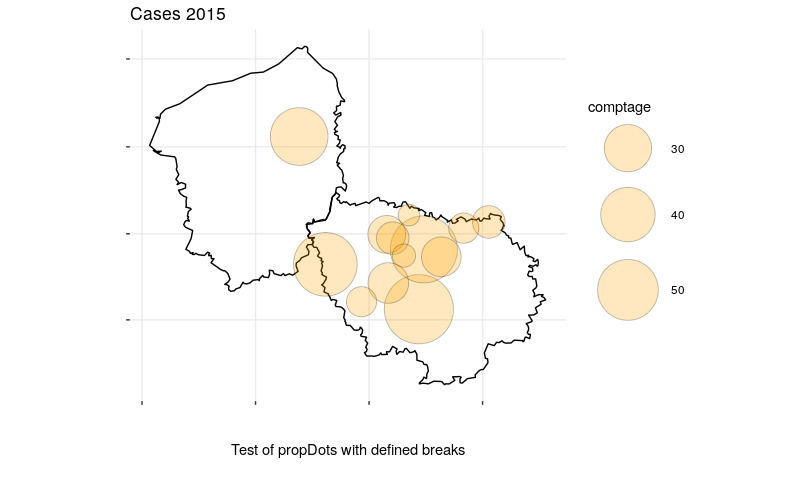

\newpage
```{r eval=FALSE}
propDots(Region, data = W, value = "comptage", color="green",
         range=c(30,70),
         breaks=c(30, 40, 50, 70, 100),
         title="Cases 2015",
         note="Test of propDots with forced range of breaks",
         labels = c("< 30", "30 - 40", "40 - 50", "50 -70", "70 - 100"))
```
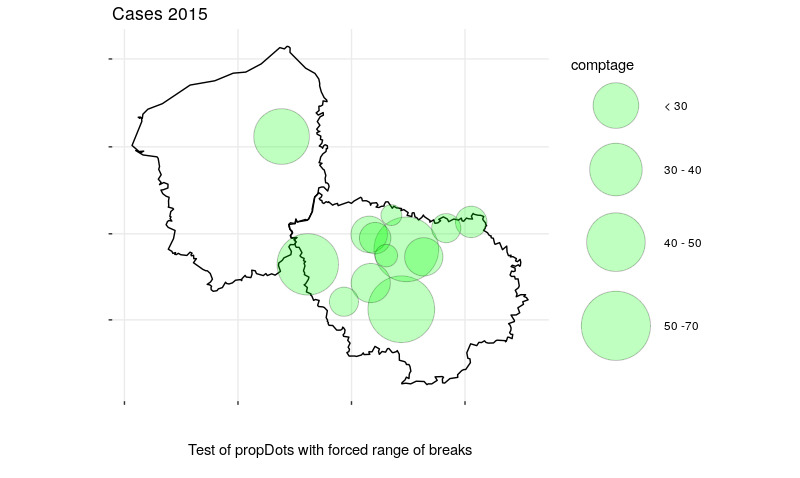

\newpage
## Plotting dots with classified size

### classDots()

*classDots*(

            x, 
            
            data, color="red", 
            
            value = NULL, 
            
            breaks = NULL,
            
            steps = 5, 
            
            labels = NULL, 
            
            opacity = 0.5, 
            
            title="",
            
            note=NULL, 
            
            legend = NULL
            
           )


Parameter | Description                  
--------- | --------------------------------------------------------------------------------- 
**x**  | **Object** GADMWrapper
**data** |  **Object** data.frame with columns 'latitude' and 'longitude'
**color** |	a valid color
**value** |	**Character** Name of a column in the data.frame.
**breaks** | vector of breaks
**steps** |	unused
**labels** | **Character vector** of labels
**opacity** | **float** Background opacity of the filled circles
**title** | **Character** The title of the plot
**note** | **Character** Add an annotation
**legend** | **Character** The title of the legend

\newpage
### Exemple
```{r eval=FALSE}
library(GADMTools)
library(sp)

France = gadm.loadCountries("FRA", level=1, simplify=0.01)
Region = subset(France, regions=c("Île-de-France","Haute-Normandie"), level=1)

W <- read.csv2("wepi.csv")
W$lieux_lat <- as.double(as.character(W$lieux_lat))
W$lieux_long <- as.double(as.character(W$lieux_long))
W <- rename(W, latitude = lieux_lat, longitude = lieux_long)

classDots(Region,               # Polygons
          data = W,             # Dataset
          value = "comptage",   # Varname
          color="#ff9900",
          breaks=c(1, 10, 30, 50, 60, 100),
          legend = "Emergency",
          title = "Classes of points",
          opacity = 0.6,
          note = "Cases 2015"
)

```
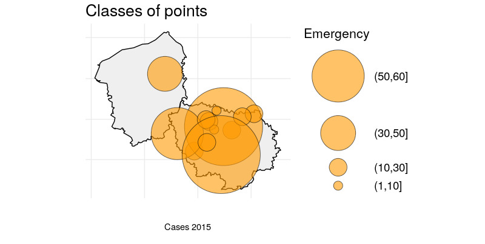

\newpage
## Plotting density

### isopleth()

*isopleth*(
           x,
           
           data,
           
           palette=NULL,
           
           title=""
          )


Parameter | Description                  
--------- | --------------------------------------------------------------------------------- 
**x** |	**Object** GADMWrapper
**data** | **data.frame** - data to plot
**palette** | **String** - An RColorBrewer palette name or a String vector vector of colors. Default NULL.
**title** | **String** - Plot title. Default is an empty string.

\newpage
### Example
```{r eval=FALSE}
library(GADMTools)
library(sp)

France = gadm.loadCountries("FRA", level=1, simplify=0.01)
W <- read.csv2("wepi.csv")
W$lieux_lat <- as.double(as.character(W$lieux_lat))
W$lieux_long <- as.double(as.character(W$lieux_long))
colnames(W)[1] <- "latitude"
colnames(W)[2] <- "longitude"
Region = subset(France, regions=c("Île-de-France","Haute-Normandie"), level=1)
isopleth(Region, W)
```
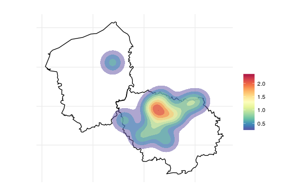

\newpage
## Plotting a choropleth

### choropleth()

*choropleth*(

             x, data, value=NULL, breaks = NULL, steps = 5,

             adm.join=NULL, legend = NULL, 
             
             labels = NULL, palette=NULL, title=""
             
             )


Parameter | Description                  
--------- | --------------------------------------------------------------------------------- 
**x** | **Object** GADMWrapper
**data** | **data.frame** - data to plot
**value** | **String** - the name of the column in the data.frame we want to plot (eg: an incidence in epidemiology studies)
**breaks** | **Vector** of breaks values or a **Sring** name of a function from *classIntervals* (one of "sd", "equal", "pretty", "quantile", "kmeans", "hclust", "bclust", "fisher", or "jenks").
**steps** | **Integer** - number of breaks. Default = 5. If breaks is NOT NULL this value is used internally with cut().
**adm.join** | **String** - the name in GADM spdf dataset which will be joined with a column of the data.
**legend** | **String** - legend title. Default NULL.
**labels** | **String** vector labels for the legend. Default NULL
**palette** | **String** - An RColorBrewer palette name or a String vector vector of colors. Default NULL.
**title** | **String** - Title of the plot. Default is an empty string.

\newpage
### Example
```{r eval=FALSE}
library(GADMTools)
library(sp)
library(dplyr)

MAP <- gadm.loadCountries("BEL", level = 3, simplify=0.01)
DAT = read.csv2("BE_clamydia_incidence.csv")

# Rewriting District names
# ------------------------
DAT$district <- as.character(DAT$district)
DAT[7,1] = "Brussel"
DAT[20,1] <- "Liège"
DAT[22,1] = "Marche-en-Famenne"
DAT[27,1] = "Neufchâteau"

# Here is the main trick !
# -----------------------------------------------------
DAT <- rename(DAT, NAME_3 = district)

choropleth(MAP, DAT,
           adm.join = "NAME_3",
           value = "rate03",
           breaks = "sd",
           palette="Oranges", legend = "Incidence",
           title="Chlamydia incidence by Belgian district for 2003)")
```
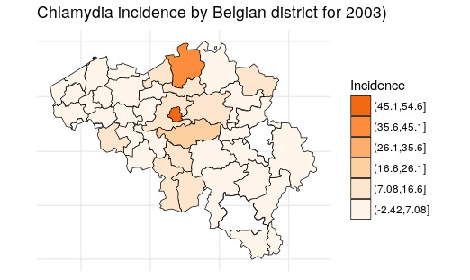

\newpage
### fast.choropleth()

*fast.choropleth*(

                  x, data, value=NULL,
                  
                  breaks = NULL, steps = 5,
  
                  adm.join=NULL, legend = NULL,
                  
                  labels = NULL,
                  
                  palette=NULL, title=""
                  
                 )
                 
Parameter | Description                  
--------- | --------------------------------------------------------------------------------- 
**x**	| **Object** GADMWrapper
**data**	| **data.frame** - data to plot
**value**	| **String** - the name of the column in the data.frame we want to plot (eg: an incidence in epidemiology studies)
**breaks**	| 
**steps**	| **Integer** - number of breaks. Default = 5. If breaks is NOT NULL this value is used internally with cut().
**adm.join**	| **String** - the name in GADM spdf dataset which will be joined with a column of the data.
**legend**	| **String** - legend title. Default NULL.
**labels**	| **String vector** labels for the legend. Default NULL
**palette**	| **String** - An RColorBrewer palette name or a String vector vector of colors. Default NULL.
**title**	| **String** - Title of the plot. Default is an empty string.

\newpage
### Example
```{r eval=FALSE}
MAP <- gadm.loadCountries("BEL", level = 3, simplify=0.01)
DAT = read.csv2("BE_clamydia_incidence.csv")

# Rewriting District names
# ------------------------
DAT$district <- as.character(DAT$district)
DAT[7,1] = "Brussel"
DAT[20,1] <- "Liège"
DAT[22,1] = "Marche-en-Famenne"
DAT[27,1] = "Neufchâteau"
DAT <- rename(DAT, NAME_3 = district)


fast.choropleth(MAP, DAT,
                adm.join = "NAME_3",
                value = "rate03",
                steps = 4,
                breaks = "jenks",
                palette="Greens",
                legend = "Incidence",
                title="Chlamydia incidence by Belgian district (2003)")
```


              